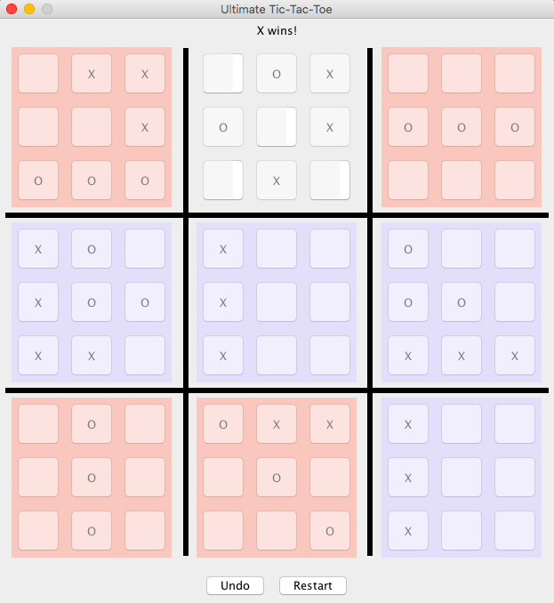

# Ultimate Tic-Tac-Toe
*Play Ultimate Tic-Tac-Toe, a highly strategic version of Tic-Tac-Toe involving forethought and "checkmates" much like chess!*

The goal of Ultimate Tic-Tac-Toe is to complete three of the small tictactoe boards to win the global board. Small boards are won as per the normal rules of tic-tac-toe, as is the global board with relation to the nine small boards. The catch is that each move will send your opponent to the corresponding board on the global board, as indicated by a yellow highlight. Thus, it is commonplace to see a player miss what seems like a simple win on a board to send their opponent to a different board.

If a player is sent to a completed board, then he/she can move to **any** open position. Using this strategy wisely in the endgame can force your opponent into situations where their only move is to send you to a completed board, allowing you to easily claim boards for your victory.

I built the game using Java Swing. You can download/clone this as a Java Project and jump right into playing the game! Also, a more detailed read about the game and strategies can be found on the [Wikipedia page](https://en.wikipedia.org/wiki/Ultimate_tic-tac-toe).

